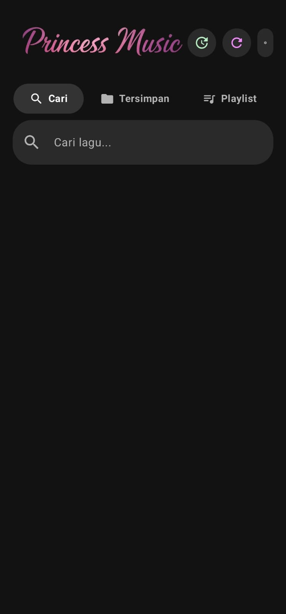
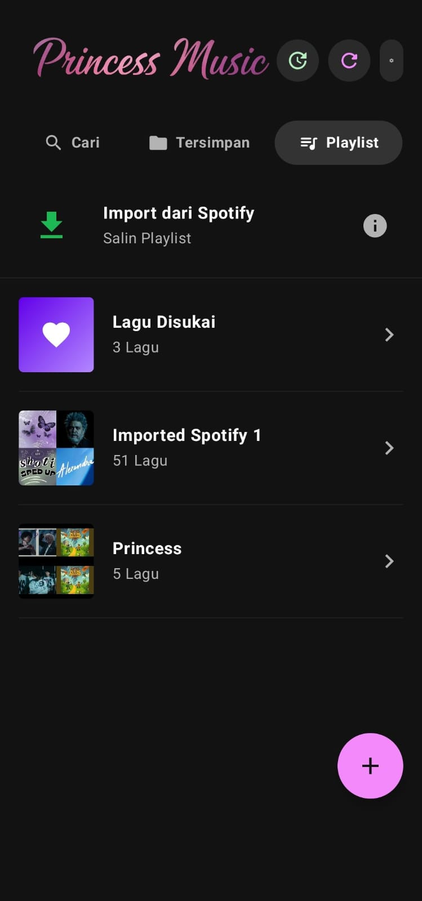
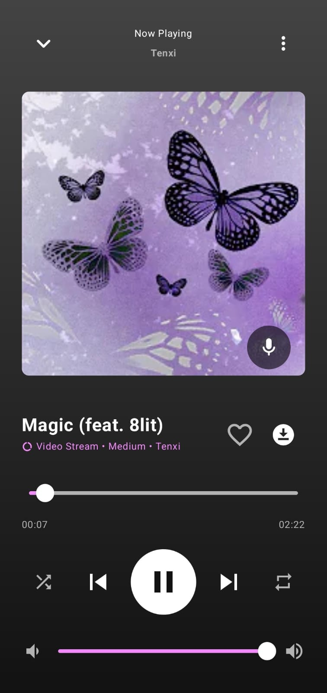
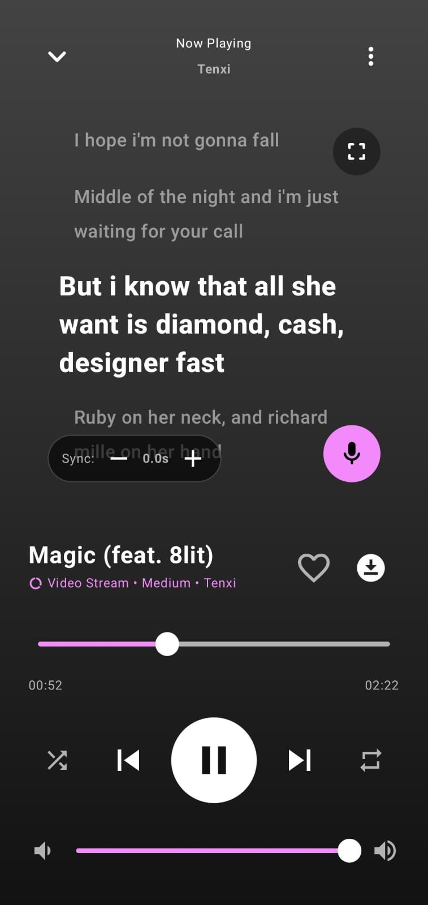

  <strong>🇬🇧 English</strong> • <a href="README_id.md">🇮🇩 Indonesia</a>

  

<h3 align="center">A Free Android Music Streaming App built with Kotlin & Jetpack Compose</h3>

  
  
  
  

## 📖 About the App

**Princess Music** is an Android music streaming application designed specifically for a free, fast, and uninterrupted listening experience. Unlike paid streaming platforms, Princess Music focuses on high-resolution audio playback performance with a minimalist interface and absolutely zero ads.

## ✨ Key Features

- **Ad-Free Streaming**: Stream millions of songs limitlessly without any audio or visual ad intrusions.
- **Offline Playback**: Download songs directly to your device's local storage to listen without an internet connection.
- **Real-time Lyrics**: Dynamic lyrics synchronization that runs accurately based on the song's current duration.
- **Spotify Playlist Import**: Instant migration! Simply paste a Spotify playlist link, and the system will automatically search and add all tracks for streaming.
- **In-App Updater**: Automatic Over-The-Air (OTA) update system integrated directly with the latest GitHub releases.

## 🛠️ Tech Stack

The modern infrastructure and libraries powering Princess Music under the hood:

  
  
  
  
  
  
  

## 📥 How to Install

1. Open the **[Releases](https://github.com/dfchanelxd/Princess-Music/releases)** page in this repository.
2. Download the `.apk` file from the latest release version (e.g., `Princess.Music.vx.x.apk`).
3. Open the downloaded APK file on your Android device (Compatible with **Android 8.0 Oreo** and above).
4. If a security dialog appears, allow *Install from unknown sources*.
5. Done! Open the app and start streaming your favorite music. 🎶

## 📸 Screenshots

| Home & Search                  | Playlist & Import                     | Player Screen                     | Player Lyrics                     |
|--------------------------------|---------------------------------------|-----------------------------------|-----------------------------------|
|       |             |         |         |

## 🔒 Security Protocol

Princess Music is verified **100% virus and malware free**.

Every distributed APK release (*build artifacts*) is always pre-scanned using **VirusTotal** with over 70 threat detection engines before being uploaded to the public.

This application is standalone and **does not contain** any backdoors, crypto-miners, hidden ad SDKs, or telemetry trackers.

## 🤝 Contribution & Support

This project is independently developed (Solo Developer) by **Dio (dfchanelxd)**.

If you find this application useful, please consider giving a ⭐ **Star** to this repository. You can also report bugs or propose new features via the **Issues** tab.

To support server costs and the developer's coffee, you can provide support via:

  
  

## ⚠️ Disclaimer

This application is completely **free** and built purely for educational purposes and the exploration of modern Android architecture.  
Please use the music streaming/download features wisely and always respect the Intellectual Property Rights (IPR) of the respective copyright owners.

---

*Built with ❤️ by [DioFikriyanto](https://github.com/dfchanelxd)*
